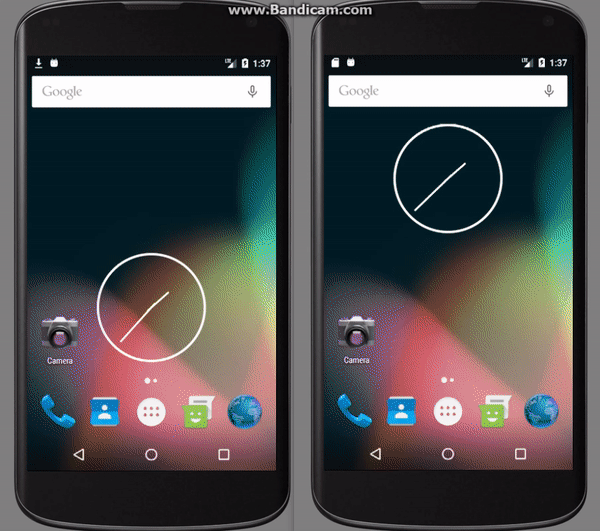
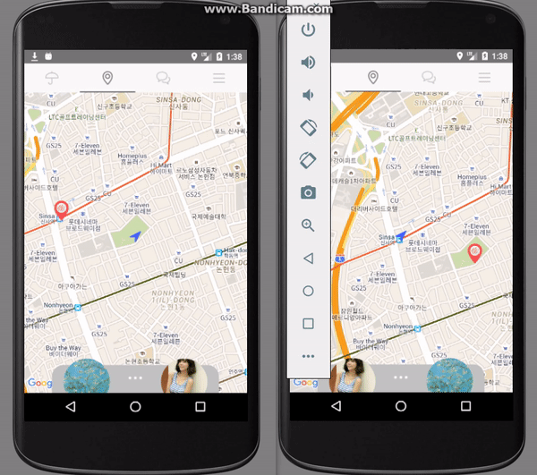
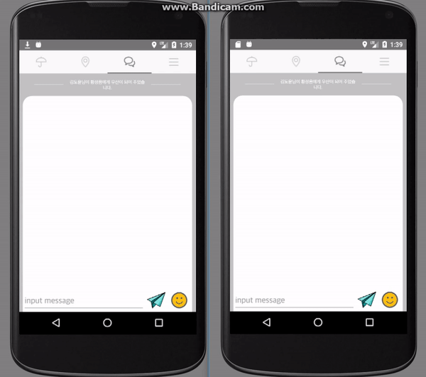

# Be

### Summary
This application is for connecting between persons who have an umbrella and who hasn't. Every person can find and invite to near others who need or have umbrella through this service. Once connected, they can share Location and chat each other.

### Member
 * Designer : Deokha, Jieun
 * Android Developer : Doyoon, Guozhe

### Fetures
#### Send and Receive Inviting between each user.


#### Realtime location tracking


#### chatting


#### Edit Profile


### Code Fetures
#### MVP

Apart from traditional MVP pattern.
```java
public interface ChatView {
    void addChat(Chat chat);
    void notifySetChanged();
    void setFocusLastItem();
    void updateProfileView();
    void updateTitle();
}
```

```java
public class ChatFragment extends Fragment implements ChatView {

    @Nullable
    @Override
    public View onCreateView(LayoutInflater inflater, @Nullable ViewGroup container, @Nullable Bundle savedInstanceState) {
       
        ...

        /* Set AppPresenter */
        AppPresenter.getInstance().setChatView(this);
        
        ...
        
        return view;
    }
}
```


#### Firebase Helper
Using Firebase is very simple and easy. In spite of that, It is annoying work which every time remeber domain path and write. Even It is hard to see Database structure clearly. Because every model is scattered each class.

```
String modelPath = "/root/.../.../model";

FirebaseDatabase.getInstance().getReference(modelPath).addListenerForSingleValueEvent(Listener l);

FirebaseDatabase.getInstance().getReference(modelPath).setValue(Object o);

```

In that reason, I made `FirebaseHelper` class. It uses XML which is written in asset folder. When application starts, it analyzes XML and calculate model path. So you can get Model Path easily.

and It also supports AutogenerateKey.(Some value needs auto generated hash key) All you need to do is remember access key if it is `primary-key`

Now you can see and mange `database structure` easily.

```
String modelPath = FirebaseHelper.getModelPath("giver", String... accessKey)

FirebaseDatabase.getInstance().getReference(modelPath).addListenerForSingleValueEvent(Listener l);
```

[see all xml](./app/src/main/assets/database_structure.xml)
```xml
<root>
    <activeusers type="reference-key">
        <givers type="reference-key">
            <giver type="value" isBundle="true" isAutoGenerateModelKey="true" refer="">
                <activeuser type="geo-value"/>
            </giver>
        </givers>
        ...
    </activeusers>
    ... 
</root>
```

#### Keep all data recently.
When user changed profile Image, It does not mean only need to update current view. Espeacially in view pager case.
becase View Pager always create three views for Left and Right swiping.(If left and right view has profile image) In order to solve this problem, I made `UserProfileView Interface` and after inserted user profile image, `Presenter' notify all view which has profile image.


#### prevent memory leak
When using splash

Detach

### Opinion
In my case, I realize User Status is important on the way. That is not enough which is using just `Condition`,
so I'm late but I separate User Status four, `NOT_YET_MATCHED`, `ON_FINDING`, `ON_MATCHING`, `ON_TOGEHTER`
 
the other focus is apply MVP Pattern, the advantage of MVP Pattern is I can change my view model easily.

and finally I try to data every data keeps always up-to-date

And also, using Interface and Abstract class I try to keep every class has recycleable and reuse.

I really hope this code helps even a little.

### Version History
    * V0.1
        * 

### Behind

#### Google API on Walking
Finding the path on warlking in google api is not working properyl. So if you consider any service has using walking path.
Consider another api..

### Util update

* Dialog manager
* Firebase `Get Model Path` and `Read` at Once in FirebaseDao class using FirebaseModel class
* String left and right padding

### Solved Problem
* RealtimeBlurView -> Rounded Blur view -> Top roundedBlurView -> Path

### Reference
#### Gradle
* [Realtime Blur](https://android-arsenal.com/details/1/4409)
#### API
* [Google Maps Android Api v2 Sample](https://github.com/googlemaps/android-samples)

#### Activity LifeCycle
* [About on Destroy](https://stackoverflow.com/questions/18361719/android-activity-ondestroy-is-not-always-called-and-if-called-only-part-of-the)

#### View
* [Set Color Image View](https://stackoverflow.com/questions/38653357/how-to-set-color-for-imageview-in-android)
* [remove ListView divider](https://stackoverflow.com/questions/5414902/how-to-remove-the-border-in-a-listview)
* [Claculate between two point latlng](https://stackoverflow.com/questions/14394366/find-distance-between-two-points-on-map-using-google-map-api-v2)
* [Fragment Transaction Slide in Slide out](https://stackoverflow.com/questions/21026409/fragment-transaction-animation-slide-in-and-slide-out)
* [Fragment animation back stack](https://stackoverflow.com/questions/10886669/how-to-reverse-fragment-animations-on-backstack)
###
