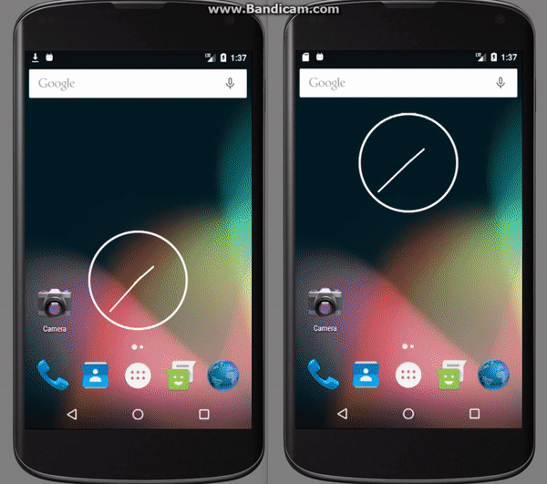
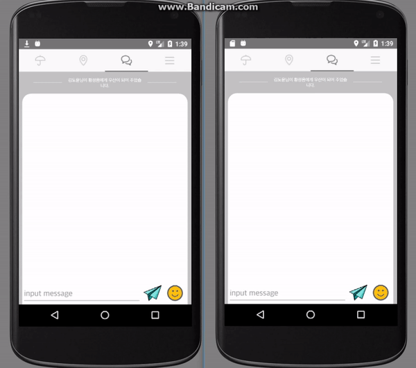

# Be

[README KR](./README_kr.md)

### Summary
이 응용 프로그램은 우산을 가진 사람과없는 사람을 연결하기위한 것입니다. 모든 사람은이 서비스를 통해 우산을 필요로하거나 소유하고있는 다른 사람들을 찾아서 초대 할 수 있습니다. 연결되면 위치를 공유하고 서로 채팅 할 수 있습니다.

### Member
 * 디지아너 : 덕하, 지은
 * 안드로이드 개발자 : 도윤, 곽철
 
### Fetures
#### Send and Receive Inviting between each user.


#### Realtime location tracking


#### chatting


#### Edit Profile


### Code Fetures
#### MVP

At first I implement presenter in each fragment. But In my case I can't handle `data` properly in that. For example, after once attach firebase listener. That listener can be shared some of fragment(because I used ViewPager). I thought that type of design has duplicated listener and it's not good everytime I have to care the listener. 

So, aparted from traditional MVP pattern. I made AppPresenter with Singleton. Every firebase Listener(`ChatListener`, `GeoQueryListener`, `MatchingCompleteListener`, `OtherUserLocationListener`, `PickmeRequestListener`) is declared in AppPresenter. It has `Callback` interface, I made every business logic possible to be written in `AppPresenter` class.


#### Firebase Helper
Firebase 사용은 매우 간단하고 쉽습니다. 그럼에도 불구하고 매번 도메인 경로를 기억하고 작성하는 것은 성가신 작업입니다. 심지어 데이터베이스 구조를 명확하게 볼 수 없습니다. 모든 모델은 각 클래스에 흩어져 있기 때문입니다.

```java
String modelPath = "/root/.../.../model";

FirebaseDatabase.getInstance().getReference(modelPath).addListenerForSingleValueEvent(Listener l);

FirebaseDatabase.getInstance().getReference(modelPath).setValue(Object o);

```

In that reason, I made `FirebaseHelper` class. It uses XML which is written in asset folder. When application starts, it analyzes XML and calculate model path. So you can get Model Path easily.

and It also supports AutogenerateKey.(Some value needs auto generated hash key) All you need to do is remember access key if it is `primary-key`

Now you can see and mange `database structure` easily.

```java
String modelPath = FirebaseHelper.getModelPath("giver", String... accessKey)

FirebaseDatabase.getInstance().getReference(modelPath).addListenerForSingleValueEvent(Listener l);
```

[see all xml](./app/src/main/assets/database_structure.xml)
```xml
<root>
    <activeusers type="reference-key">
        <givers type="reference-key">
            <giver type="value" isBundle="true" isAutoGenerateModelKey="true" refer="">
                <activeuser type="geo-value"/>
            </giver>
        </givers>
        ...
    </activeusers>
    ... 
</root>
```

#### Keep all data recently.
When user changed profile Image, It does not mean only need to update current view. Espeacially in view pager case.
becase View Pager always create three views for Left and Right swiping.(If left and right view has profile image) In order to solve this problem, I made `UserProfileView Interface` and after inserted user profile image, `Presenter' notify all view which has profile image.


```java
public interface ChatView {
    void addChat(Chat chat);
    void notifySetChanged();
    void setFocusLastItem();
    void updateProfileView();
    void updateTitle();
}
```

```java
public class ChatFragment extends Fragment implements ChatView {

    @Nullable
    @Override
    public View onCreateView(LayoutInflater inflater, @Nullable ViewGroup container, @Nullable Bundle savedInstanceState) {
       
        ...

        /* Set AppPresenter */
        AppPresenter.getInstance().setChatView(this);
        
        ...
        
        return view;
    }
}
```


#### prevent memory leak
When using splash

Detach

### Opinion
In my case, I realize User Status is important on the way. That is not enough which is using just `Condition`,
so I'm late but I separate User Status four, `NOT_YET_MATCHED`, `ON_FINDING`, `ON_MATCHING`, `ON_TOGEHTER`
 
the other focus is apply MVP Pattern, the advantage of MVP Pattern is I can change my view model easily.

and finally I try to data every data keeps always up-to-date

And also, using Interface and Abstract class I try to keep every class has recycleable and reuse.

I really hope this code helps even a little.

### Version History
    * V0.1
        * 

### Behind

#### Google API on Walking
Finding the path on warlking in google api is not working properyl. So if you consider any service has using walking path.
Consider another api..

### Util update

* Dialog manager
* Firebase `Get Model Path` and `Read` at Once in FirebaseDao class using FirebaseModel class
* String left and right padding

### Solved Problem
* RealtimeBlurView -> Rounded Blur view -> Top roundedBlurView -> Path

### Reference
#### Gradle
* [Realtime Blur](https://android-arsenal.com/details/1/4409)
#### API
* [Google Maps Android Api v2 Sample](https://github.com/googlemaps/android-samples)

#### Activity LifeCycle
* [About on Destroy](https://stackoverflow.com/questions/18361719/android-activity-ondestroy-is-not-always-called-and-if-called-only-part-of-the)

#### View
* [Set Color Image View](https://stackoverflow.com/questions/38653357/how-to-set-color-for-imageview-in-android)
* [remove ListView divider](https://stackoverflow.com/questions/5414902/how-to-remove-the-border-in-a-listview)
* [Claculate between two point latlng](https://stackoverflow.com/questions/14394366/find-distance-between-two-points-on-map-using-google-map-api-v2)
* [Fragment Transaction Slide in Slide out](https://stackoverflow.com/questions/21026409/fragment-transaction-animation-slide-in-and-slide-out)
* [Fragment animation back stack](https://stackoverflow.com/questions/10886669/how-to-reverse-fragment-animations-on-backstack)
###
